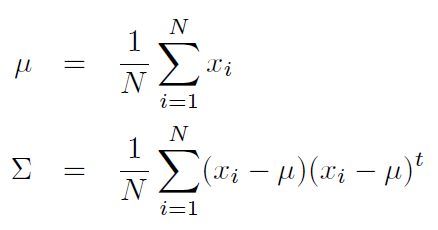

Given samples of a class, x1, x2, ... xn, each being an d-dimensional vector, we define the mean, , ¦Ì, and the covariance matrix, ¦² are defined as:

**Properties of ¦Ì and ¦²**

  - Note that xis are d-dimensional column vectors, and hence the mean, ¦Ì, is also a d-dimensional column vector. The covariance matrix, ¦², is a dxd symmetric square matrix.
  
  - The mean, ¦Ì is the centroid of the samples in the feature space.
  
  - The covariance matrix, ¦² is a positive semi-definite matrix.

